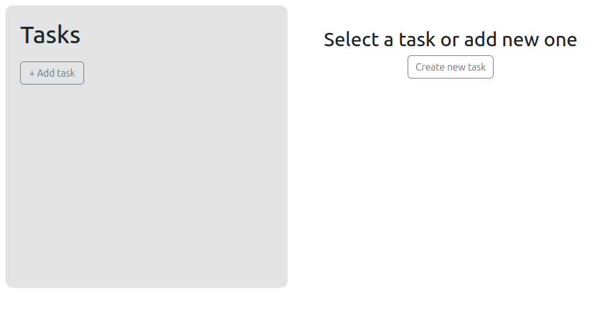
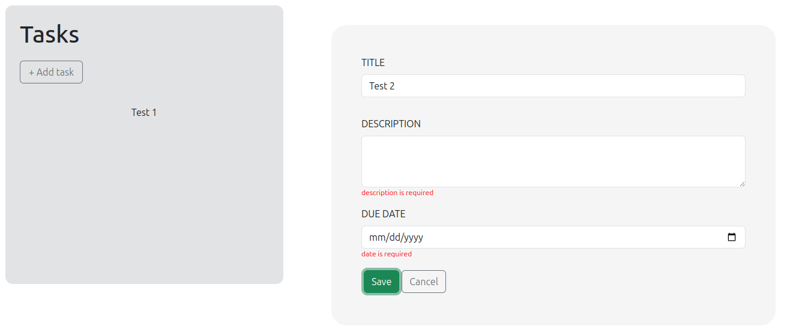
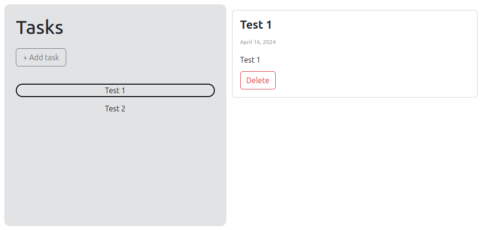

# to-do-app
This project is a very simple to-do-app (add, delete, check tasks; validation)
The main purpose of this project was to get knowledge about Bootstrap & consolidate knowledge of React.

## Demo

**[Live preview](https://merk0n.github.io/to-do-app/)**

main page
:--------------------------------------------------:

add task           |  check task
:-------------------------:|:-------------------------:
  |  
